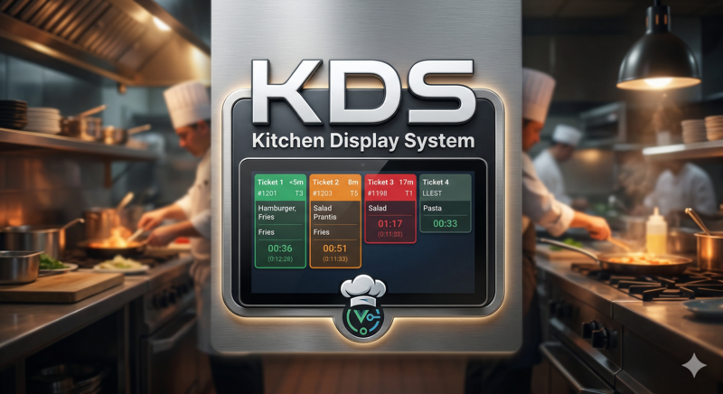

<p align="center">
  
</p>

# KDS - Kitchen Display System

Sistema de visualització de cuina en temps real per a restaurants. Mostra els tiquets de comandes pendents i permet al personal de cuina gestionar l'estat de preparació dels plats.

## Funcionalitats

- Panell de cuina amb tiquets en temps real (WebSocket)
- Gestió d'estat dels plats: Pendent → Preparant → Llest → Servit
- Agrupació per famílies (primers, segons, postres...)
- Temporitzadors visuals amb codis de color
- Alertes sonores configurables
- Estadístiques de comandes i temps de preparació
- Múltiples modes de vista: graella, columnes, llista

## Tecnologies

- Vue 3 + Vue Router + Vuex
- Socket.io (temps real)
- Docker + Nginx (producció)

## Instal·lació

```bash
npm install
npm run serve    # Dev (port 3002)
npm run build    # Producció
```

## Docker

```bash
docker-compose up --build   # Port 3001
```
